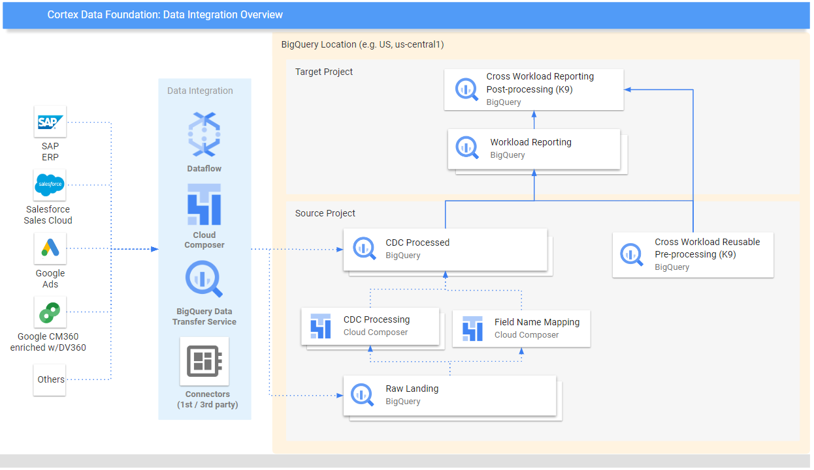
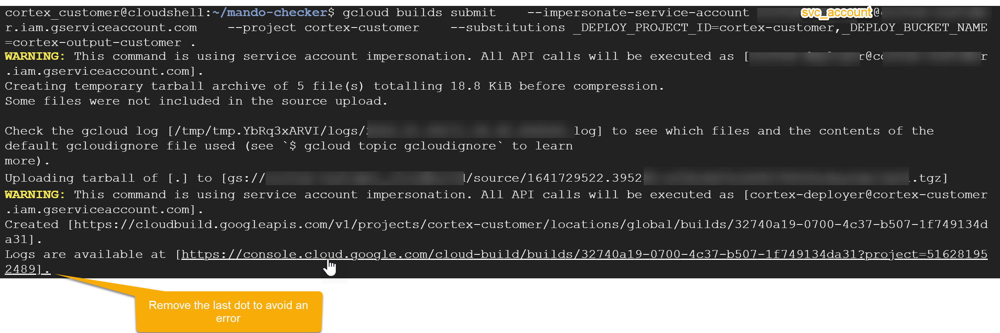
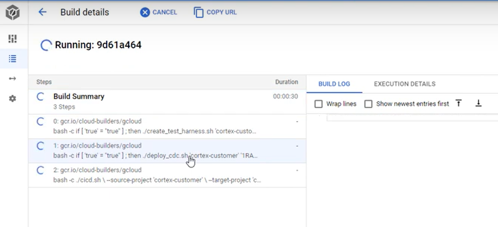
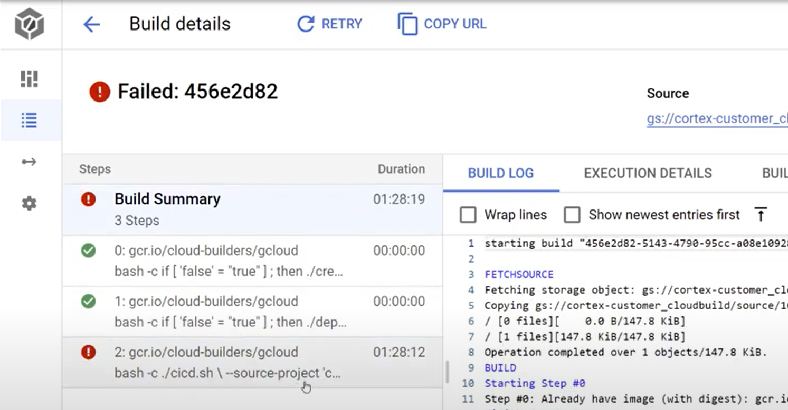
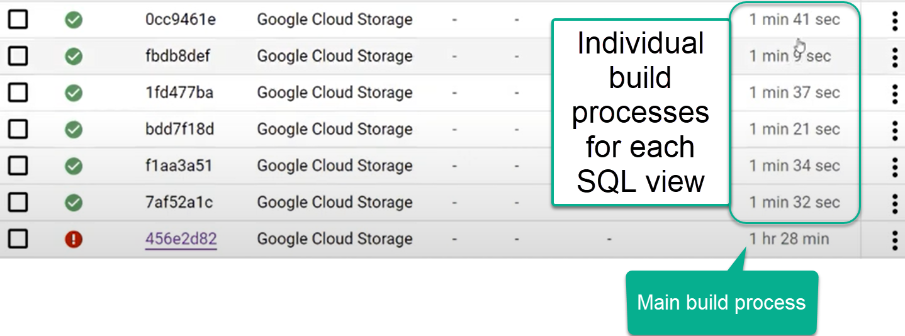
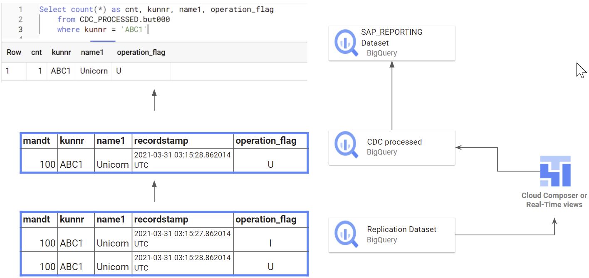

# **Google Cloud Cortex Framework**


Contents


# About the Data Foundation for Google Cloud Cortex Framework
The Data Foundation for [Google Cloud Cortex Framework](https://cloud.google.com/solutions/cortex) is a set of analytical artifacts, that an be automatically deployed together with reference architectures. 

The current repository contains the analytical views and models that serve as a foundational data layer for the Google Cloud Cortex Framework in BigQuery. You can find and entity-relationship diagram [here](images/erd.png).


# TL;DR for setup
If you are in a hurry and already know what you are doing, clone this repository recursively with submodules (`--recurse-submodules`) and execute the following command.

```bash
gcloud builds submit --project <<execution project, likely the source>> \
--substitutions \
_PJID_SRC=<<project for landing raw data>>,_PJID_TGT=<<project to deploy user-facing views>>,_DS_CDC=<<BQ dataset to land the result of CDC processing - must exist before deployment>>,_DS_RAW=<<BQ dataset to land raw data from replication - must exist before deployment>>,_DS_REPORTING=<<BQ dataset where Reporting views are created, will be created if it does not exist>>,_DS_MODELS=<<BQ dataset where ML views are created, will be created if it does not exist>>,_GCS_BUCKET=<<Bucket for logs - Cloud Build Service Account needs access to write here>>,_TGT_BUCKET=<<Bucket for DAG scripts - don’t use the actual Airflow bucket - Cloud Build Service Account needs access to write here>>,_TEST_DATA=true,_DEPLOY_CDC=true

```


# **Deployment**

You can find a step-by-step video going through a deployment with sample data in YouTube: [`[English version]`](https://youtu.be/_A0UrgR1gwk) - [`[Version en Español]`](https://youtu.be/jBBgSGoD3DU )

# Prerequisites


## Understand the Framework

Before continuing with this guide, make sure you are familiar with:

-   Google Cloud Platform [fundamentals](https://www.coursera.org/lecture/gcp-fundamentals/welcome-to-gcp-fundamentals-I6zpd)
-   How to navigate the Cloud Console, [Cloud Shell](https://cloud.google.com/shell/docs/using-cloud-shell) and [Cloud Shell Editor](https://cloud.google.com/shell/docs/editor-overview)
-   Fundamentals of [BigQuery](https://cloud.google.com/bigquery/docs/introduction)
-   Fundamentals of [Cloud Composer](https://cloud.google.com/composer/docs/concepts/overview) or [Apache Airflow](https://airflow.apache.org/docs/apache-airflow/stable/concepts/index.html)
-   Fundamental concepts of[ Change Data Capture and dataset structures](#understanding-change-data-capture-understanding-change-data-capture). 
-   General navigation of [Cloud Build](https://cloud.google.com/build/docs/overview)
-   Fundamentals of [Identity and Access Management](https://cloud.google.com/iam/docs/)


## Establish project and dataset structure

You will require at least one GCP project to host the BigQuery datasets and execute the deployment process. 

This is where the deployment process will trigger Cloud Build runs. In the project structure, we refer to this as the [Source Project](#dataset-structure-dataset-structure). 



If you currently have a replication tool from SAP ECC or S/4 HANA, such as the [BigQuery Connector for SAP](https://cloud.google.com/solutions/sap/docs/bq-connector-for-sap-install-config), you can use the same project (Source Project) or a different one for reporting. 

**Note:** If you are using an existing dataset with data replicated from SAP, you can find the list of required tables in [`setting.yaml`](https://github.com/GoogleCloudPlatform/cortex-dag-generator/blob/main/setting.yaml). If you do not have all of the required tables replicated, only the views that depend on missing tables will fail to deploy. 

You will need to identify:

*   **Source Google Cloud Project:** Project where the source data is located, from which the data models will consume. 
*   **Target Google Cloud Project:** Project where the Data Foundation for SAP predefined data models will be deployed and accessed by end-users. This may or may not be different from the source project depending on your needs. 
*   **Source BigQuery Dataset:** BigQuery dataset where the source SAP data is replicated to or where the test data will be created.
*   **CDC BigQuery Dataset:** BigQuery dataset where the CDC processed data lands the latest available records. This may or may not be the same as the source dataset.
*   **Target BigQuery reporting dataset:** BigQuery dataset where the Data Foundation for SAP predefined data models will be deployed.
*   **Target BigQuery machine learning dataset:** BigQuery dataset where the BQML predefined models will be deployed.

**Alternatively**, if you do not have a replication tool set up or do not wish to use the replicated data, the deployment process can generate test tables and data for you. You will still need to [create](https://cloud.google.com/bigquery/docs/datasets) and identify the datasets ahead of time.


## Enable Required Components

The following Google Cloud components are required: 

*   Google Cloud Project
*   BigQuery instance and datasets
*   Service Account with Impersonation rights
*   Cloud Storage Buckets 
*   Cloud Build API
*   Cloud Resource Manager API
*   Optional components:
    *   [Cloud Composer](https://console.cloud.google.com/marketplace/product/google/composer.googleapis.com) for change data capture (CDC) processing and hierarchy flattening through Directed Acyclic Graphs ([DAG](https://airflow.apache.org/docs/apache-airflow/stable/concepts/dags.html)s). You can find how to set up an instance of Cloud Composer in the [documentation](https://cloud.google.com/composer/docs/how-to/managing/creating). 
    *   Looker **(optional, connects to reporting templates. Requires manual setup) **

From the [Cloud Shell](https://shell.cloud.google.com/?fromcloudshell=true&show=ide%2Cterminal), you can enable Google Cloud Services using the _gcloud_ command line interface in your Google Cloud project.  

Replace the `<<SOURCE_PROJECT>>` placeholder with your source project. Copy and paste the following command into the cloud shell:


```bash
gcloud config set project <<SOURCE_PROJECT>>
gcloud services enable bigquery.googleapis.com \
                       cloudbuild.googleapis.com \
                       composer.googleapis.com \
                       storage-component.googleapis.com \
                       cloudresourcemanager.googleapis.com

```


You should get a success message:


## Data Requirements


### SAP ECC or S/4 raw tables

The Data Foundation for SAP data models require a number of raw tables to be replicated to BigQuery before deployment. For a full list of tables required to be replicated, check the [setting.yaml](https://github.com/GoogleCloudPlatform/cortex-dag-generator/blob/main/setting.yaml) file.

If you do not have a replication tool or do not wish to use replicated data the deployment process can create the tables and populate them with sample test data.

Notes:
*   If a table does not exist during deployment, only the views that require it will fail. 
*   The SQL files refer to the tables in lowercase. See the [documentation in BigQuery](https://cloud.google.com/bigquery/docs/reference/standard-sql/lexical#case_sensitivity) for more information on case sensitivity.

### CDC processing flags

If not using test data, make sure the replication tool includes the fields required for CDC processing or merges changes when inserting them into BigQuery. You can find more details about this requirement [here](#setting-up-cdc-processing). The BigQuery Connector for SAP can include these fields by default with the [Extra Field flag](https://cloud.google.com/solutions/sap/docs/bq-connector-for-sap-planning#default-field-names).


### DD03L for metadata

If you are **not planning on deploying test data**, and if you **are planning on generating CDC DAG scripts** during deployment, make sure table **DD03L** is replicated from SAP in the source project. 

This table contains metadata about tables, like the list of keys, and is needed for the CDC generator and dependency resolver to work. This table will also allow you to add tables not currently covered by the model to generated CDC scripts, like custom or `Z` tables.


## Grant permissions to the executing user

If an individual is executing the deployment with their own account, they will need, at minimum, the following permissions in the project where Cloud Build will be triggered:

*   Service Usage Consumer
*   Storage Object Viewer for the Cloud Build default bucket or bucket for logs
*   Object Writer to the output buckets
*   Cloud Build Editor
*   Project Viewer or Storage Object Viewer

These permissions may vary depending on the setup of the project. Consider the following documentation if you run into errors:
*   [Permissions to run Cloud Build](https://cloud.google.com/build/docs/securing-builds/configure-access-to-resources) 
*   [Permissions to storage for the Build Account](https://cloud.google.com/build/docs/securing-builds/store-manage-build-logs)
*   [Permissions for the Cloud Build service account](https://cloud.google.com/build/docs/securing-builds/configure-access-for-cloud-build-service-account)
*   [Viewing logs from Builds](https://cloud.google.com/build/docs/securing-builds/store-manage-build-logs#viewing_build_logs)

## Configure the Cloud Build account

In the source project, navigate to the [Cloud Build](https://console.cloud.google.com/cloud-build/settings/service-account) and locate the account that will execute the deployment process.


Locate the build account in [IAM](https://pantheon.corp.google.com/iam-admin/iam) (make sure it says _cloudbuild_):


Grant the following permissions to the Cloud Build service account in both the source and target projects if they are different:

- BigQuery Data Editor
- BigQuery Job User

## [Optional] Create a Service Account for deployment with impersonation

The deployment can run through a service account with impersonation rights, by adding the flag [\--impersonate-service-account](https://cloud.google.com/sdk/gcloud/reference/builds/submit). This service account will trigger a Cloud Build job, that will in turn run specific steps through the Cloud Build service account. This allows the consultant to trigger a deployment process without direct access to the resources.

The impersonation rights to the new, triggering service account need to be granted to the person running the command. 

Navigate to the [Google Cloud Platform Console](https://console.cloud.google.com/iam-admin/serviceaccounts/create) and follow the steps to create a service account with the following role:

*   Cloud Build Service Account

This role can be applied during the creation of the service account:


Authorize the ID of user who will be running the deployment to impersonate the service account that was created in the previous step. Authorize your own ID so you can run an initial check as well.


Once the service account has been created, navigate to the[ IAM Service Account administration](https://console.cloud.google.com/iam-admin/serviceaccounts), click on the service account, and into the Permissions tab. 

Click **Grant Access**, type in the ID of the user who will execute the deployment and has impersonation rights, and assign the following role:


*   Service Account Token Creator


**Alternatively,** you can complete this step from the Cloud Shell:

```bash
gcloud iam service-accounts create <<SERVICE ACCOUNT>> \
    --description="Service account for Cortex deployment" \
    --display-name="my-cortex-service-account"

gcloud projects add-iam-policy-binding <<SOURCE_PROJECT>> \
--member="serviceAccount:<<SERVICE ACCOUNT>>@<<SOURCE_PROJECT>>.iam.gserviceaccount.com" \
--role="roles/cloudbuild.builds.editor"

gcloud iam service-accounts add-iam-policy-binding <<SERVICE ACCOUNT>>\
  --member="user:<<CONSULTANT EMAIL>>" \
  --role="roles/iam.serviceAccountTokenCreator"
```


## Create a Storage bucket

A storage bucket will be required to leave any processing scripts that are generated. These scripts will be manually moved into a Cloud Composer or Apache Airflow instance after deployment.

Navigate to [Cloud Storage](https://console.cloud.google.com/storage/create-bucket) and create a bucket **in the same region** as your BigQuery datasets.

**Alternatively**, you can use the following command to create a bucket from the Cloud Shell:

```bash
gsutil mb -l <REGION/MULTI-REGION> gs://<BUCKET NAME>
```

Navigate to the _Permissions_ tab. Grant `Storage Object Creator` to the user executing the Build command or to the Service account you created for impersonation.

## [Optional] Create a Storage bucket for logs

You can create a specific bucket for the Cloud Build process to store the logs. Create a [GCS bucket](https://console.cloud.google.com/storage) with uniform access control, in the same region where the deployment will run. 

**Alternatively**, here is the command line to create this bucket: 

```bash
gsutil mb -l <REGION/MULTI-REGION> gs://<BUCKET NAME>
```

You will need to grant `Object Admin` permissions to the Cloud Build service account. 

# Setup

## Check setup

You can now run a simple script, the Cortex Deployment Checker, to simulate the deployment steps and make sure the prerequisites are fulfilled.

You will use the service account and Storage bucket created as prerequisites to test permissions and make sure the deployment is successful.


1. Clone repository from https://github.com/fawix/mando-checker. You can complete this from the [Cloud Shell](https://shell.cloud.google.com/?fromcloudshell=true&show=ide%2Cterminal).

```bash
git clone  https://github.com/fawix/mando-checker
```


2. From Cloud Shell , change into the directory: 

```bash
cd mando-checker
```


3. Run the following build command with the user that will run the deployment

```bash
gcloud builds submit \
   --project <<SOURCE_PROJECT>> \
   --substitutions _DEPLOY_PROJECT_ID=<<SOURCE_PROJECT>>,_DEPLOY_BUCKET_NAME=<<GCS_BUCKET>>,_LOG_BUCKET_NAME=<<LOG_BUCKET>> .
```

If using a service account for impersonation, add the following flag:

```bash
   --impersonate-service-account <<SERVICE ACCOUNT>>@<<SOURCE_PROJECT>>.iam.gserviceaccount.com \
```

Where


*   <code>SOURCE_PROJECT</code></strong> is the ID of the project that will receive the deployment
*   <strong><code>SERVICE_ACCOUNT</code></strong> is the impersonation service account to run the build
*   <strong><code>GCS_BUCKET</code></strong> is the bucket that will contain the CDC information
*   <strong><code>LOG_BUCKET</code></strong> is the bucket where logs can be written. You can skip this parameter if using the default.

You may further customize some parameters if desired (see table below).

You can check the progress from the build in the log from Cloud Build:




The build will complete successfully if the setup is ready or fail if permissions need to be checked:


## Parameters for Checker

The table below contains the parameters that can be passed to the build for further customizing the test.


<table>
  <tr>
   <td style="background-color: #3362b5"><strong>Variable name</strong>
   </td>
   <td style="background-color: #3362b5"><strong>Req ?</strong>
   </td>
   <td style="background-color: #3362b5"><strong>Description</strong>
   </td>
  </tr>
  <tr>
   <td style="background-color: #e3f2fd"><strong><code> _DEPLOY_PROJECT_ID</code></strong>
   </td>
   <td style="background-color: #e3f2fd">Y
   </td>
   <td style="background-color: #e3f2fd">The project ID that will contain the tables and bucket. Defaults to the same project ID running the build 
   </td>
  </tr>
  <tr>
   <td style="background-color: null"><strong><code> _DEPLOY_BUCKET_NAME</code></strong>
   </td>
   <td style="background-color: null">Y
   </td>
   <td style="background-color: null">Name of the GCS bucket which will contain the logs. 
   </td>
  </tr>
  <tr>
   <td style="background-color: #e3f2fd"><strong><code> _DEPLOY_TEST_DATASET</code></strong>
   </td>
   <td style="background-color: #e3f2fd">N
   </td>
   <td style="background-color: #e3f2fd">Test dataset to be created. 
<p>
Default: "DEPLOY_DATASET_TEST"
   </td>
  </tr>
  <tr>
   <td style="background-color: null"><strong><code> _DEPLOY_TEST_TABLE</code></strong>
   </td>
   <td style="background-color: null">N
   </td>
   <td style="background-color: null">Test table to be created. 
<p>
Default: "DEPLOY_TABLE_TEST"
   </td>
  </tr>
  <tr>
   <td style="background-color: #e3f2fd"><strong><code> _DEPLOY_TEST_FILENAME</code></strong>
   </td>
   <td style="background-color: #e3f2fd">N
   </td>
   <td style="background-color: #e3f2fd">Test file to be created. 
<p>
Default: "deploy_gcs_file_test_cloudbuild.txt"
   </td>
  </tr>
  <tr>
   <td style="background-color: null"><strong><code> _DEPLOY_TEST_DATASET_LOCATION</code></strong>
   </td>
   <td style="background-color: null">N
   </td>
   <td style="background-color: null">Location used for BQ ( 
<p>
https://cloud.google.com/bigquery/docs/locations )  
<p>
Default: "US"
   </td>
  </tr>
</table>


## How it works

The Cortex Deployment Checker is a very simple utility that will try to exercise the required permissions to ensure that they are correctly set up.


1. List the given bucket
2. Write to the bucket
3. Create a BQ dataset
4. Create a BQ table in the dataset
5. Write a test record

The utility will also clean up the test file and dataset - however this operation may fail since the deletion permissions are not actually required for the deployment, then it needs to be manually cleaned up without any repercussions.

If the build completes successfully all mandatory checks passed, otherwise review the build logs for the missing permission and retry.


# Deploy the Data Foundation

## Clone the Data Foundation repository

Clone this repository with submodules (`--recurse-submodules`) into an environment where you can execute the `gcloud builds submit` command and edit the configuration files. We recommend using the [Cloud Shell](https://shell.cloud.google.com/?fromcloudshell=true&show=ide%2Cterminal).

## Configure CDC

You can use the configuration in the file [`setting.yaml`](https://github.com/GoogleCloudPlatform/cortex-dag-generator/blob/main/setting.yaml) if you need to generate change-data capture processing scripts. See the [Appendix - Setting up CDC Processing](#setting-up-cdc-processing) for options. For test data, you can leave this file as a default.

Make any changes to the [DAG templates](https://github.com/GoogleCloudPlatform/cortex-dag-generator/blob/main/src/template_dag/dag_sql.py) as required by your instance of Airflow or Cloud Composer. You will find more information in the [Appendix - Gathering Cloud Composer settings](#gathering-cloud-composer-settings)]

**Note**: If you do not have an instance of Cloud Composer, you can still generate the scripts and create it later.

## Configure Hierarchies

You can use the configuration in the file [`sets.yaml`](https://github.com/GoogleCloudPlatform/cortex-dag-generator/blob/main/sets.yaml) if you need to generate scripts to flatten hierarchies. See the [Appendix - Configuring the flattener])#configuring-the-flattener-for-sap-hierarchies) for options. This step is only executed if the CDC generation flag is set to true.

## Gather the parameters

You will need the following parameters ready for deployment, based on your target structure:

*   **Source Project** (`_PJID_SRC`): Project where the source dataset is and the build will run.
*   **Target Project** (`_PJID_TGT`): Target project for user-facing datasets (reporting and ML datasets)
*   **Raw landing dataset** (`_DS_RAW`): Used by the CDC process, this is where the replication tool lands the data from SAP.  If using test data, create an empty dataset.
*   **CDC Processed Dataset** (`_DS_CDC`): Dataset that works as a source for the reporting views, and target for the records processed DAGs. If using test data, create an empty dataset.
*   **Reporting Dataset** (`_DS_REPORTING`): Name of the dataset that is accessible to end users for reporting, where views and user-facing tables are deployed
*   **ML dataset** (`_DS_ML`): Name of the dataset that stages results of Machine Learning algorithms or BQML models
*   **Logs Bucket** (`_GCS_BUCKET`): Bucket for logs. Could be the default or [created previously]((#create-a-storage-bucket).
*   **DAGs bucket** (`_TGT_BUCKET`): Bucket where DAGs will be generated as [created previously]((#create-a-storage-bucket). Avoid using the actual airflow bucket.
*   **Deploy test data** (`_TEST_DATA`): Set to true if  the customer wants the _DATASET_REPL to be filled by tables with sample data, mimicking a replicated dataset. Default is --noreplace.
*   **Generate and deploy CDC** (`_DEPLOY_CDC`): Generate the DAG files into a target bucket based on the tables in settings.yaml.  If using test data, set to true.

Optional parameters:

*   **Location or Region** (`_LOCATION`): Location where the BigQuery dataset and GCS buckets are (Options: US, ASIA or EU)
*   **Mandant or Client** (`_MANDT`): Default mandant or client for SAP. For test data, keep the default value.
*   **SQL flavor for source system** (`_sql-flavour`): S4 or ECC. See the documentation for options. For test data, keep the default value.

## Execute the build

Switch to the directory where the data foundation was cloned:

```bash
cd cortex-data-foundation
```

Run the Build command with the parameters you identified earlier:

```bash
gcloud builds submit --project <<execution project, likely the source>> \
--substitutions \
_PJID_SRC=<<project for landing raw data>>,_PJID_TGT=<<project to deploy user-facing views>>,_DS_CDC=<<BQ dataset to land the result of CDC processing - must exist before deployment>>,_DS_RAW=<<BQ dataset to land raw data from replication - must exist before deployment>>,_DS_REPORTING=<<BQ dataset where Reporting views are created, will be created if it does not exist>>,_DS_MODELS=<<BQ dataset where ML views are created, will be created if it does not exist>>,_GCS_BUCKET=<<Bucket for logs - Cloud Build Service Account needs access to write here>>,_TGT_BUCKET=<<Bucket for DAG scripts - don’t use the actual Airflow bucket - Cloud Build Service Account needs access to write here>>,_TEST_DATA=true,_DEPLOY_CDC=false
```

If you have enough permissions, you can see the progress from [Cloud Build](https://console.cloud.google.com/cloud-build/).



After the test data and CDC generation steps, you will see the step that generates views triggers one build process per view. If a single view fails, the parent process will appear as failed:



You can check the results for each individual view, following the main Build process.



And identify any issues with individual builds:


## Move the files into the DAG bucket

If you opted to generate the CDC files and have an instance of Airflow, you can move them into their final bucket with the following command:

```bash
gsutil cp -r  gs://<<output bucket>>/dags gs://<<composer dag bucket>>/dags
gsutil cp -r  gs://<<output bucket>>/data gs://<<composer sql bucket>>/data/bq_data_replication
```
If sets were generated, move the Python library for hierarchies into a folder called hierarchies:

```bash
gsutil cp -r  gs://<<output bucket>>/hierarchies gs://<<composer dag bucket>>/dags/hierarchies/
```

# Next steps

## Looker deployment
Optionally, you can deploy the blocks from the [Looker Marketplace](https://marketplace.looker.com/marketplace/detail/cortex) and explore the pre-built visualizations.  you will find the instructions for the setup [in Looker](https://docs.looker.com/data-modeling/marketplace).

# Support

To file issues and feature requests against these models or deployers, create an issue in this repo.

# Appendix


## Understanding Change Data Capture


### Replicating raw data

The goal of the Data Foundation for SAP is to expose data and analytics models for reporting and applications. The models consume the data replicated from an SAP ECC or SAP S/4HANA system using a preferred replication tool, like the [BigQuery Connector for SAP](https://cloud.google.com/blog/products/data-analytics/bigquery-connector-for-sap).

Data from SAP ECC or S/4HANA is expected to be replicated in raw form, that is, with the same structure as the tables in SAP and without transformations. The names of the tables in BigQuery should be lower case for cortex data model compatibility reasons. 

For example, fields in table T001 are replicated using their equivalent data type in BigQuery, without transformations:


### Change Data Capture (CDC) Processing

BigQuery is an append preferred database. This means that the data is not updated or merged during replication. For example, an update to an existing record can be replicated as the same record containing the change. To avoid duplicates, a merge operation needs to be applied afterwards. This is referred to as [Change Data Capture processing](https://cloud.google.com/architecture/database-replication-to-bigquery-using-change-data-capture).

The Data Foundation for SAP includes the option to create scripts for Cloud Composer or Apache Airflow to [merge](https://cloud.google.com/bigquery/docs/reference/standard-sql/dml-syntax) or “upsert” the new records resulting from updates and only keep the latest version in a new dataset. For these scripts to work the tables need to have a field with an operation flag named **operation\_flag**  **(I = insert, U = update, D = delete) **and a timestamp named recordstamp.

For example, the following image shows the latest records for each partner record, based on the timestamp and latest operation flag:


### Dataset structure

Data from SAP is replicated into a BigQuery dataset  -the source or replicated dataset- and the updated or merged results are inserted into another dataset- the CDC dataset. The reporting views select data from the CDC dataset, to ensure the reporting tools and applications always have the latest version of a table.




Some replication tools can merge or upsert the records when inserting them into BigQuery, so the generation of these scripts is optional. In this case, the setup will only have a single dataset. The SAP\_REPORTING dataset will fetch updated records for reporting from that dataset.


## Optional - Using different projects to segregate access

Some customers choose to have different projects for different functions to keep users from having excessive access to some data. The deployment allows for using two projects, one for processing replicated data, where only technical users have access to the raw data, and one for reporting, where business users can query the predefined models or views. 


Using two different projects is optional. A single project can be used to deploy all datasets.


## Setting up CDC processing

During deployment, you can choose to merge changes in real time using a view in BigQuery or scheduling a merge operation in Cloud Composer (or any other instance of Apache Airflow).

Cloud Composer can schedule the scripts to process the merge operations periodically. Data is updated to its latest version every time the merge operations execute, however, more frequent merge operations  translate into higher costs.


The scheduled frequency can be customized to fit the business needs. 

Download and open the sample file using gsutil from the Cloud Shell as follows:


```
gsutil cp gs://cortex-mando-sample-files/mando_samples/settings.yaml .
```


You will notice the file uses[ scheduling supported by Apache Airflow](https://airflow.apache.org/docs/apache-airflow/1.10.1/scheduler.html#dag-runs).

The following example shows an extract from the configuration file:


```
data_to_replicate:
  - base_table: adrc 
    load_frequency: "@hourly"
  - base_table: adr6
    target_table: adr6_cdc
    load_frequency: "@daily"
```


This configuration will:


1. Create a copy from **source\_project\_id.REPLICATED\_DATASET.adrc**  into **target\_project\_id.DATASET\_WITH\_LATEST\_RECORDS.adrc** if the latter does not exist
2. Create a CDC script in the specified bucket
3. Create a copy from source\_project\_id.REPLICATED\_DATASET.adr6  into target\_project\_id.DATASET\_WITH\_LATEST\_RECORDS.adr6\_cdc if the latter does not exist
4. Create a CDC script in the specified bucket

If you want to create DAGs or runtime views to process changes for tables that exist in SAP and are not listed in the file, add them to this file before deployment. For example, the following configuration creates a CDC script for custom table “_zztable\_customer”_ and a runtime view to scan changes in real time for another custom table called “_zzspecial\_table”_:


```
  - base_table: zztable_customer 
    load_frequency: "@daily"
  - base_table: zzspecial_table
    load_frequency: "RUNTIME"
```


This will work as long as the table DD03L is replicated in the source dataset and the schema of the custom table is present in that table.

The following template generates the processing of changes. Modifications, such as the name of the timestamp field, or additional operations, can be done at this point:


```
MERGE `${target_table}` T
USING (SELECT * FROM `${base_table}` WHERE recordstamp > (SELECT IF(MAX(recordstamp) IS NOT NULL, MAX(recordstamp),TIMESTAMP("1940-12-25 05:30:00+00")) FROM `${target_table}`)) S
ON ${p_key}
WHEN MATCHED AND S.operation_flag='D' AND S.is_deleted = true THEN
  DELETE
WHEN NOT MATCHED AND S.operation_flag='I' THEN
  INSERT (${fields}) 
  VALUES 
  (${fields})
WHEN MATCHED AND S.operation_flag='U' THEN
UPDATE SET 
    ${update_fields}

```


Alternatively, if your business requires near-real time insights and the replication tool supports it, the deployment tool accepts the option RUNTIME. This means a CDC script will not be generated. Instead, a  view will scan and fetch the latest available record at runtime for [immediate consistency](https://cloud.google.com/architecture/database-replication-to-bigquery-using-change-data-capture#immediate_consistency_approach). 

The following parameters will be required for the automated generation of change-data-capture batch processes:


*   Source project + dataset: Dataset where the SAP data is streamed or replicated. For the CDC scripts to work by default, the tables need to have a timestamp field (called recordstamp) and an operation field with the following values, all set during replication:
    *   I: for insert
    *   U: for update
    *   D: for deletion
*   Target project + dataset for the CDC processing: The script generated by default will generate the tables from a copy of the source dataset if they do not exist.
*   Replicated tables: Tables for which the scripts need to be generated
*   Processing frequency: Following the cron notation, how frequently the dags are expected to run
*   Target GCS bucket where the CDC output files will be copied
*   The name of the connection used by Cloud Composer
*   Optional: If the result of the CDC processing will remain in the same dataset as the target, you can specify the name of the target table.


## Gathering Cloud Composer Settings

If Cloud Composer is available, create a connection to the Source Project[ in Cloud Composer](https://cloud.google.com/composer/docs/how-to/managing/connections#creating_new_airflow_connections) called sap\_cdc\_bq. 

The GCS bucket structure in the template DAG expects the folders to be in /data/bq\_data\_replication .  Alternatively, you can mass modify the generated dags with a replace command as the consultant will instruct after deployment.


If you do not have an environment of Cloud Composer available yet, you can deploy it afterwards and move the files as the Consultant will instruct.


## Configuring the flattener for SAP hierarchies

The deployment process can optionally flatten hierarchies represented as sets (e.g. transaction GS03) in SAP. The process can also generate the DAGs for these hierarchies to be refreshed periodically and automatically. This process requires configuration prior to the deployment and should be known by a Financial or Controlling consultant or power user. 

Download and open the sample file using gsutil from the Cloud Shell as follows:


```
gsutil cp gs://cortex-mando-sample-files/mando_samples/sets.yaml .
```


This [video](https://youtu.be/5s0DzRa_7D4) explains how to perform the configuration to flatten hierarchies.

The deployment file takes the following parameters:


*   Name of the set
*   Class of the set (as listed by SAP in standard table SETCLS)
*   Organizational Unit: Controlling Area or additional key for the set
*   Client or Mandant
*   Reference table for the referenced master data
*   Reference key field for master data
*   Additional filter conditions (where clause)

The following are examples of configurations for Cost Centers and Profit Centers including the technical information. If unsure about these parameters, consult with a Finance or Controlling SAP consultant.


```
sets_data:
#Cost Centers: 
# table: csks, select_fields (cost center): 'kostl', where clause: Controling Area (kokrs), Valid to (datbi)
- setname: 'H1' 
  setclass: '0101'
  orgunit: '1000'
  mandt:  '800'
  table: 'csks'
  key_field: 'kostl'
  where_clause: [ kokrs = '1000', datbi >= cast('9999-12-31' as date)]
  load_frequency: "@daily"
#Profit Centers: 
# setclass: 0106, table: cepc, select_fields (profit center): 'cepc', where clause: Controlling Area (kokrs), Valid to (datbi)
- setname: 'HE' 
  setclass: '0106'
  orgunit: '1000'
  mandt:  '800'
  table: 'cepc'
  key_field: 'prctr'
  where_clause: [ kokrs = '1000', datbi >= cast('9999-12-31' as date) ]  
  load_frequency: "@monthly"
#G/L Accounts: 
# table: ska1, select_fields (GL Account): 'saknr', where clause: Chart of Accounts (KTOPL), set will be manual. May also need to poll Financial Statement versions.  

```


This configuration will generate two separate DAGs. For example, if there were two configurations for Cost Center hierarchies, one for Controlling Area 1000 and one for 2000, the DAGs would be 2 different files and separate processes but the target, flattened table would be the same.

**Important:** If re-running the process and re-initializing the load, make sure the tables are truncated. The CDC and initial load processes do not clear the contents of the tables which means the flattened data will be inserted again.

# License
This source code is licensed under Apache 2.0. Full license text is available in [LICENSE](https://github.com/GoogleCloudPlatform/cortex-data-foundation/blob/main/LICENSE).
